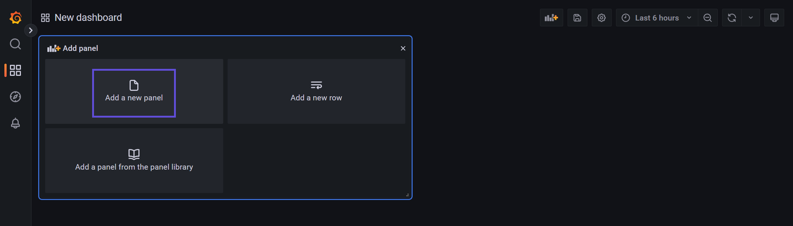

# Monitoring HStreamDB Using Grafana

Having a comprehensive visualisation of the metrics of the deployed HStreamDB cluster makes it
easier for analysing the status and diagnosing problems. This document aimed at describing how to
deploy the Grafana and its corresponding tools along with HStreamDB instances.

## Architecture Overview and Development Instructions

<!--  -->

A binary of HStream HTTP Server can be downloaded from
the [release page](https://github.com/hstreamdb/http-services/releases). Start the HTTP Server
by `<path-to-decompressed-release>/bin/http-server -services-url <hstreamdb-server address>` as a
dependency of HStream Metrics Exporter. The HTTP Server will collect metrics and execute admin
requests.

The HStream Metrics Exporter can be started similarly, which exports the metrics to Prometheus as a
Prometheus target. Usages and releases can be found on
its [homepage](https://github.com/hstreamdb/hstream-metrics-exporter).

The Node Exporter is also a Prometheus target, which serves as an exporter for monitoring the
machine metrics. It should be deployed one per HStream node. Information about the installation and
usage can be found on its [homepage](https://github.com/prometheus/node_exporter).

The above two steps are used for setting the Prometheus target, which would export some time-series
data for the incoming queries.

Prometheus can be started by Docker with custom configuration files.

```shell
docker run                                                    \
    -p 9090:9090                                              \
    -v /path/to/prometheus.yml:/etc/prometheus/prometheus.yml \
        prom/prometheus
```

The configuration files must
include the configurations for using HStream Metrics Exporter as target and scrape intervals. Check
the [Prometheus guide](https://prometheus.io/docs/prometheus/latest/getting_started/) for details.
The server URL option (which have a default value) of the HStream Metrics Exporter set during the
previous step would be used in the Prometheus configuration.

The above steps are used for setting data sources for Grafana, which would be used in making data
visualizations such as Grafana dashboards.

To install and run Grafana using Docker, take the open-source version as an example.

```shell
docker run                              \
    -p 3000:3000                        \
    -e GF_AUTH_ANONYMOUS_ORG_ROLE=Admin \
    -e GF_AUTH_ANONYMOUS_ENABLED=true   \
    -e GF_AUTH_DISABLE_LOGIN_FORM=true  \
        grafana/grafana-oss
```

Here are a few options making **just having a preview** of monitoring HStreamDB easier.

- `GF_AUTH_ANONYMOUS_ORG_ROLE=Admin`: enable anonymous organization as Grafana admin, which is able
  to add data sources
- `GF_AUTH_ANONYMOUS_ENABLED=true`: enable and use an anonymous organization as default organization
- `GF_AUTH_DISABLE_LOGIN_FORM=true`: make the above two options work, in addition, skip log in
  screen

### Provisioning Grafana

The provisioning settings consist of two steps:

- First, set the Grafana data sources
- Second, set the Grafana dashboards

To start with, create a folder with the following hierarchy:

```
provisioning/
├── dashboards/
└── datasources/
```

To use with Docker, add the option `<path-to>/provisioning:/etc/grafana/provisioning` to Docker
options.

In the `dashboards` folder, a file named `dashboards.yml` must be used for set up provisioning
data sources. An example would be like:

```yml
apiVersion: 1

datasources:
  - name: Prometheus
    id: 1
    uid: TNX2D3rnk
    orgId: 1
    type: prometheus
    typeName: Prometheus
    typeLogoUrl: public/app/plugins/datasource/prometheus/img/prometheus_logo.svg
    access: proxy
    url: http://localhost:9090
    password: ""
    user: ""
    database: ""
    basicAuth: false
    isDefault: true
    jsonData:
    httpMethod: POST
    readOnly: false
```

In the `dashboards` folder, a file named `dashboards.yml` must be used for set up provisioning
dashboards. An example would be like:

```yml
apiVersion: 1

providers:
  - name: "DS_PROMETHEUS"
    orgId: 1
    folder: ""
    type: file
    disableDeletion: false
    updateIntervalSeconds: 10
    allowUiUpdates: true
    options:
      path: /etc/grafana/provisioning/dashboards
      foldersFromFilesStructure: true
```

The `path` field here is corresponding to the path in Docker options which had been bind to,
namely `/etc/grafana/provisioning`. Grafana will treat all JSON files in the `path` folder as
dashboards which would be imported on start up. The JSON format dashboards can be export from
created dashboards.

### Query Metrics and Create Dashboards with Grafana

With the above required services started, one can do metrics queries and visualise data with
Grafana.

The following creates a new metrics panel on the Dashboards tab:

Click on "Add panel":


Click on "Add a new panel":



Under the "Query" tab, use the metrics explorer under the "Metrics" tab to select the HStream
metrics. Use the query builder to construct the query, and edit the title and more attributes. Then
save the new panel.


Click on "Save dashboard", then export as JSON for provisioning and import usages.


