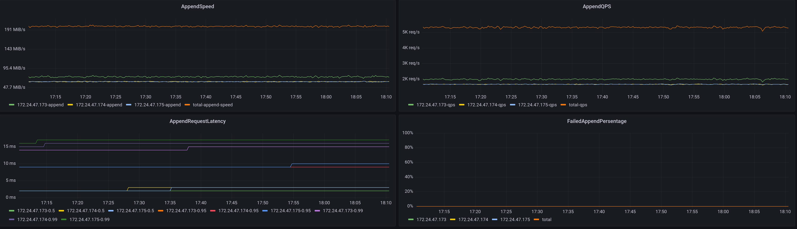
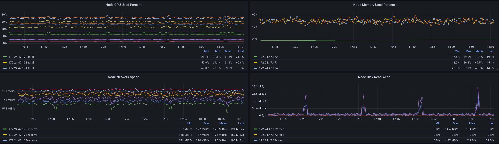

# Monitoring HStreamDB with Grafana

A comprehensive metrics visualisation of the deployed HStreamDB cluster makes it
easier to analyse the status and diagnose problems. This document describes the
deployment of Grafana and related tools with a running HStreamDB instance.

## Installations and Set-up

Now user can use the deployment tool `hdt` to set up HStreamDB monitor stack quickly. Refer to [Deployment with Hdt](../deployment/quick-deploy-ssh.md). 

With monitor stack components all set up, we can now monitor HStreamDB metrics with dashboard.

