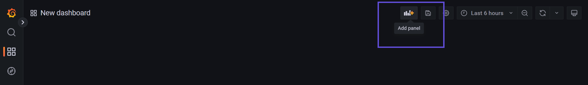
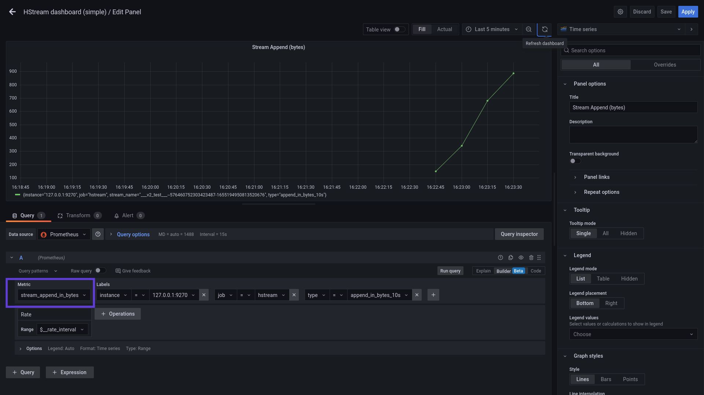
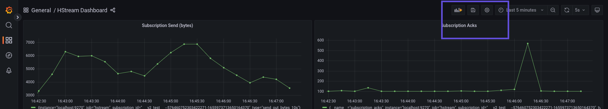

# Monitoring HStreamDB with Grafana

A comprehensive metrics visualisation of the deployed HStreamDB cluster makes it
easier to analyse the status and diagnose problems. This document describes the
deployment of Grafana and related tools with a running HStreamDB instance.

## Installations and Set-up

### Setup Data Source for Grafana (Setup HStream Http Server and Prometheus)

Download the HStream HTTP Server binary from the
[release page](https://github.com/hstreamdb/http-services/releases).

Start the HTTP Server with

```
http-server -services-url "127.0.0.1:6570" -address "127.0.0.1:9290"
```

as a dependency of HStream Metrics Exporter. The HTTP Server will be responsible
for collecting metrics and executing admin requests.

Setting up HStream Metrics Exporter is similar. Usages and releases are
available on its
[homepage](https://github.com/hstreamdb/hstream-metrics-exporter).

```
hstream-metrics-exporter -host 127.0.0.1 -port 9270 -http-server-host 127.0.0.1 -http-server-port 9290
```

This exports the metrics to Prometheus as a Prometheus target.

Another Prometheus target we need is the Node Exporter, an exporter for hardware
and OS metrics. It should be deployed on every HStream node. Information about
the installation and usage is available on its
[homepage](https://github.com/prometheus/node_exporter).

After setting up the targets, users can start Prometheus via Docker with
configuration files.

```
docker run -p 9090:9090 -v /path/to/prometheus.yml:/etc/prometheus/prometheus.yml prom/prometheus
```

The configuration files must set scrape intervals and configure HStream Metrics
Exporter as the target. We would also need the HStream Metrics Exporter's
address in the Prometheus configuration. Check the
[Prometheus guide](https://prometheus.io/docs/prometheus/latest/getting_started/)
for details.

### Install and Start Grafana

We can install and run Grafana with Docker

```
docker run -p 3000:3000               \
  -e GF_AUTH_ANONYMOUS_ORG_ROLE=Admin \
  -e GF_AUTH_ANONYMOUS_ENABLED=true   \
  -e GF_AUTH_DISABLE_LOGIN_FORM=true  \
      grafana/grafana-oss
```

Here are a few options making **just having a preview** of monitoring HStreamDB
easier.

- `GF_AUTH_ANONYMOUS_ORG_ROLE=Admin`: enable anonymous organisation as Grafana
  admin, which is able to add data sources
- `GF_AUTH_ANONYMOUS_ENABLED=true`: enable and use an anonymous organisation as
  the default
- `GF_AUTH_DISABLE_LOGIN_FORM=true`: make the above two options work and skip
  the log-in screen

## Provision Grafana

To start with, create a folder with the following hierarchy:

```
provisioning/
├── dashboards/
└── datasources/
```

When run with Docker, use `-v <path-to>/provisioning:/etc/grafana/provisioning`
to mount the file into the container.

Create `datasources.yml` under the `datasources` folder to provision data
sources.

An example would be:

```yml
apiVersion: 1

datasources:
  - name: Prometheus
    id: 1
    uid: TNX2D3rnk
    orgId: 1
    type: prometheus
    typeName: Prometheus
    typeLogoUrl: public/app/plugins/datasource/prometheus/img/prometheus_logo.svg
    access: proxy
    url: http://localhost:9090
    password: ""
    user: ""
    database: ""
    basicAuth: false
    isDefault: true
    jsonData:
    httpMethod: POST
    readOnly: false
```

Create `dashboards.yml` under the `dashboards` folder to provision dashboards.

An example would be:

```yml
apiVersion: 1

providers:
  - name: "DS_PROMETHEUS"
    orgId: 1
    folder: ""
    type: file
    disableDeletion: false
    updateIntervalSeconds: 10
    allowUiUpdates: true
    options:
      path: /etc/grafana/provisioning/dashboards
      foldersFromFilesStructure: true
```

The `path` field here is the path Docker options bound to, for example,
`/etc/grafana/provisioning`. Grafana will treat all JSON files in the `path`
folder as dashboards, which will be imported on start-up. Dashboards created
later can also be exported to JSON files.

## Query Metrics and Create Dashboards with Grafana

With services all set up, we can now run metrics queries and visualise data with
Grafana.

The following creates a new metrics panel on the Dashboards tab:

Click on "Add panel":



Click on "Add a new panel":


Under the "Query" tab, use the metrics explorer under the "Metrics" tab to
select the HStream metrics. Use the query builder to construct the query and
provide attributes. Then save the new panel.



Click on "Save dashboard", then export as JSON for provisioning and import
usages.


