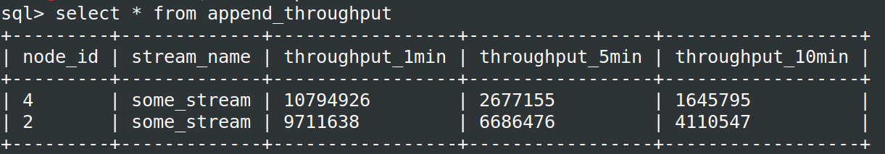

# HStreamDB release notes

## v0.14.0 [2023-02-28]

- HServer now uses the in-house Haskell GRPC framework by default
- Add deployment support for CentOS 7
- Add stats for failed record delivery in subscriptions
- Remove `pushQuery` RPC from the protocol
- Fix the issue causing client stalls when multiple clients consume the same subscription, and one fails to acknowledge
- Fix possible memory leaks caused by STM
- Fix cluster bootstrap issue causing incorrect status display
- Fix the issue that allows duplicate consumer names on the same subscription
- Fix the issue that allows readers to be created on non-existent shards
- Fix the issue causing the system to stall with the io check command

## v0.13.0 [2023-01-18]

- hserver is built with ghc 9.2 by default now
- Add support for getting the IP of the proxied client
- Add support for overloading the client's ``user-agent`` by setting ``proxy-agent``
- Fix the statistics of retransmission and response metrics of subscriptions
- Fix some issues of the processing engine
- CLI: add ``service-url`` option

## v0.12.0 [2022-12-29]

- Add a new RPC interface for getting information about clients connected to the subscription (including IP, type and version of client SDK, etc.)
- Add a new RPC interface for getting the progress of consumption on a subscription
- Add a new RPC interface for listing the current ``ShardReader``s
- Add TLS support for ``advertised-listener``s
- Add support for file-based metadata storage, mainly for simplifying deployment in local development and testing environments
- Add support for configuring the number of copies of the internal stream that stores consumption progress
- Fix the problem that the consumption progress of subscriptions was not saved correctly in some cases
- Improve the CLI tool:
  - simplify some command options
  - improve cluster interaction
  - add retry for requests
  - improve delete commands
- Switch to a new planner implementation for HStream SQL
  - Improve stability and performance
  - Improve the support for subqueries in the FROM clause
  - add a new ``EXPLAIN`` statement for viewing logical execution plans
  - more modular design for easy extension and optimization

## v0.11.0 [2022-11-25]

- Add support for getting the creation time of streams and subscriptions
- Add ``subscription`` subcommand in hstream CLI
- [**Breaking change**]Remove the compression option on the hserver side(should use end-to-end compression instead)
- Remove logid cache
- Unify resource naming rules and improve the corresponding resource naming checks
- [**Breaking change**]Rename hserver's startup parameters ``host`` and ``address`` to ``bind-address`` and ``advertised-address``
- Fix routing validation for some RPC requests
- Fix a possible failure when saving the progress of a subscription
- Fix incorrect results of ``JOIN .. ON``
- Fix the write operation cannot be retried after got a timeout error

## v0.10.0 [2022-10-28]

### Highlights

#### End-to-end compression

In this release we have introduced a new feature called end-to-end compression, which means data will be compressed in batches at the client side when it is written, and the compressed data will be stored directly by HStore. In addition, the client side can automatically decompress the data when it is consumed, and the whole process is not perceptible to the user.

In high-throughput scenarios, enabling end-to-end data compression can significantly alleviate network bandwidth bottlenecks and improve read and write performance.Our benchmark shows more than 4x throughput improvement in this scenario, at the cost of increased CPU consumption on the client side.

#### HStream SQL Enhancements

In this release we have introduced many enhancements for HStream SQL, see [here](#hstream-sql) for details.

#### HServer based on a new gRPC library

In this release we replaced the gRPC-haskell library used by HServer with a new self-developed gRPC library, which brings not only better performance but also improved long-term stability.

#### Rqlite Based MetaStore

In this release we have refactored the MetaStore component of HStreamDB to make it more scalable and easier to use. We also **experimentally** support the use of Rqlite instead of Zookeeper as the default MetaStore implementation, which will make the deployment and maintenance of HStreamDB much easier. Now HServer, HStore and HStream IO  all use a unified MetaStore to store metadata.

### HServer

#### New Features

- Add [e2e compression](#end-to-end-compression)

#### Enhancements

- Refactor the server module with a new grpc library
- Adpate to the new metastore and add support for rqlite
- Improve the mechanism of cluster resources allocation
- Improve the cluster startup and initialization process
- Improve thread usage and scheduling for the gossip module

#### Bug fixes

- Fix a shard can be assigned to an invalid consumer
- Fix memory leak caused by the gossip module
- Add existence check for dependent streams when creating a view
- Fix an issue where new nodes could fail when joining a cluster
- Fix may overflow while decoding batchedRecord
- Check metadata first before initializing sub when recving fetch request to avoid inconsistency
- Fix max-record-size option validation

### HStream SQL

- Full support of subqueries. A subquery can replace almost any expression now.
- Refinement of data types. It supports new types such as date, time, array and JSON. It also supports explicit type casting and JSON-related operators.
- Adjustment of time windows. Now every source stream can have its own time window rather than a global one.
- More general queries on materialized views.  Now any SQL clauses applicable to a stream can be performed on a materialized view, including nested subqueries and time windows.
- Optimized JOIN clause. It supports standard JOINs such as CROSS, INNER, OUTER and NATURAL. It also allows JOIN between streams and materialized views.

### HStream IO

- Add MongoDB source and sink
- Adapt to the new metastore

### Java Client

[hstream-java v0.10.0](https://github.com/hstreamdb/hstreamdb-java/releases/tag/v0.10.0) has been released:

#### New Features

- Add support for e2e compression: zstd, gzip
- Add ``StreamBuilder ``

#### Enhancements

- Use ``directExecutor`` as default executor for ``grpcChannel``

#### Bug fixes

- Fix ``BufferedProducer`` memory is not released in time
- Fix missing ``RecordId`` in ``Reader``'s results
- Fix dependency conflicts when using hstreamdb-java via maven

### Go Client

[hstream-go v0.3.0](https://github.com/hstreamdb/hstreamdb-go/releases/tag/v0.3.0) has been released:

- Add support for TLS
- Add support for e2e compression: zstd, gzip
- Improve tests

### Python Client

[hstream-py v0.3.0](https://github.com/hstreamdb/hstreamdb-py/releases/tag/v0.3.0) has been released:

- Add support for e2e compression: gzip
- Add support for hrecord in BufferedProducer

### Rust Client

Add a new [rust client](https://github.com/hstreamdb/hstreamdb-rust)

### HStream CLI

- Add support for TLS
- Add -e, --execute options for non-interactive execution of SQL statements
- Add support for keeping the history of entered commands
- Improve error messages
- Add stream subcommands

### Other Tools

- Add a new tool [hdt](https://github.com/hstreamdb/deployment-tool) for deployment

## v0.9.0 [2022-07-29]

### HStreamDB

#### Highlights

- [Shards in Streams](#shards-in-streams)
- [HStream IO](#hstream-io)
- [New Stream Processing Engine](#new-stream-processing-engine)
- [Gossip-based HServer Clusters](#gossip-based-hserver-clusters)
- [Advertised Listeners](#advertised-listeners)
- [Improved HStream CLI](#improved-hstream-cli)
- [Monitoring with Grafana](#monitoring-with-grafana)
- [Deployment on K8s with Helm](#deployment-on-k8s-with-helm)

#### Shards in Streams

We have extended the sharding model in v0.8, which provides direct access and
management of the underlying shards of a stream, allowing a finer-grained
control of data distribution and stream scaling. Each shard will be assigned a
range of hashes in the stream, and every record whose hash of `partitionKey`
falls in the range will be stored in that shard.

Currently, HStreamDB supports:

- set the initial number of shards when creating a stream
- distribute written records among shards of the stream with `partitionKey`s
- direct access to records from any shard of the specified position
- check the shards and their key range in a stream

In future releases, HStreamDB will support dynamic scaling of streams through
shard splitting and merging

#### HStream IO

HStream IO is the built-in data integration framework for HStreamDB, composed of
source connectors, sink connectors and the IO runtime. It allows interconnection
with various external systems and empowers more instantaneous unleashing of the
value of data with the facilitation of efficient data flow throughout the data
stack.

In particular, this release provides connectors listed below:

- Source connectors:
  - [source-mysql](https://github.com/hstreamdb/hstream-connectors/blob/main/docs/specs/sink_mysql_spec.md)
  - [source-postgresql](https://github.com/hstreamdb/hstream-connectors/blob/main/docs/specs/source_postgresql_spec.md)
  - [source-sqlserver](https://github.com/hstreamdb/hstream-connectors/blob/main/docs/specs/source_sqlserver_spec.md)
- Sink connectors:
  - [sink-mysql](https://github.com/hstreamdb/hstream-connectors/blob/main/docs/specs/sink_mysql_spec.md)
  - [sink-postgresql](https://github.com/hstreamdb/hstream-connectors/blob/main/docs/specs/sink_postgresql_spec.md)

You can refer to [the documentation](../io/overview.md) to learn more about
HStream IO.

#### New Stream Processing Engine

We have re-implemented the stream processing engine in an interactive and
differential style, which reduces the latency and improves the throughput
magnificently. The new engine also supports **multi-way join**, **sub-queries**,
and **more** general materialized views.

The feature is still experimental. For try-outs, please refer to
[the SQL guides](../guides/sql.md).

#### Gossip-based HServer Clusters

We refactor the hserver cluster with gossip-based membership and failure
detection based on [SWIM](https://ieeexplore.ieee.org/document/1028914),
replacing the ZooKeeper-based implementation in the previous version. The new
mechanism will improve the scalability of the cluster and as well as reduce
dependencies on external systems.

#### Advertised Listeners

The deployment and usage in production could involve a complex network setting.
For example, if the server cluster is hosted internally, it would require an
external IP address for clients to connect to the cluster. The use of docker and
cloud-hosting can make the situation even more complicated. To ensure that
clients from different networks can interact with the cluster, HStreamDB v0.9
provides configurations for advertised listeners. With advertised listeners
configured, servers can return the corresponding address for different clients,
according to the port to which the client sent the request.

#### Improved HStream CLI

To make CLI more unified and more straightforward, we have migrated the old
HStream SQL Shell and some other node management functionalities to the new
HStream CLI. HStream CLI currently supports operations such as starting an
interacting SQL shell, sending bootstrap initiation and checking server node
status. You can refer to [the CLI documentation](../reference/cli.md) for details.

#### Monitoring with Grafana

We provide a basic monitoring solution based on Prometheus and Grafana. Metrics
collected by HStreamDB will be stored in Prometheus by the exporter and
displayed on the Grafana board. For details, refer to
[the documentation](../operation/monitoring/grafana.md).

#### Deployment on K8s with Helm

We provide a helm chart to support deploying HStreamDB on k8s using Helm. You
can refer to [the documentation](../operation/deployment/deploy-helm.md) for details.

### Java Client

The
[Java Client v0.9.0](https://github.com/hstreamdb/hstreamdb-java/releases/tag/v0.9.0)
has been released, with support for HStreamDB v0.9.

### Golang Client

The
[Go Client v0.2.0](https://github.com/hstreamdb/hstreamdb-go/releases/tag/v0.2.0)
has been released, with support for HStreamDB v0.9.

### Python Client

The
[Python Client v0.2.0](https://github.com/hstreamdb/hstreamdb-py/releases/tag/v0.2.0)
has been released, with support for HStreamDB v0.9.

## v0.8.0 [2022-04-29]

### HServer

#### New Features

- Add [mutual TLS support](../operation/security/overview.md)
- Add `maxUnackedRecords` option in Subscription: The option controls the
  maximum number of unacknowledged records allowed. When the amount of unacked
  records reaches the maximum setting, the server will stop sending records to
  consumers, which can avoid the accumulation of unacked records impacting the
  server's and consumers' performance. We suggest users adjust the option based
  on the consumption performance of their application.
- Add `backlogDuration` option in Streams: the option determines how long
  HStreamDB will store the data in the stream. The data will be deleted and
  become inaccessible when it exceeds the time set.
- Add `maxRecordSize` option in Streams: Users can use the option to control the
  maximum size of a record batch in the stream when creating a stream. If the
  record size exceeds the value, the server will return an error.
- Add more metrics for HStream Server.
- Add compression configuration for HStream Server.

#### Enhancements

- [breaking changes] Simplify protocol, refactored codes and improve the
  performance of the subscription
- Optimise the implementation and improve the performance of resending
- Improve the reading performance for the HStrore client.
- Improve how duplicated acknowledges are handled in the subscription
- Improve subscription deletion
- Improve stream deletion
- Improve the consistent hashing algorithm of the cluster
- Improve the handling of internal exceptions for the HStream Server
- Optimise the setup steps of the server
- Improve the implementation of the stats module

#### Bug fixes

- Fix several memory leaks caused by grpc-haskell
- Fix several zookeeper client issues
- Fix the problem that the checkpoint store already exists during server startup
- Fix the inconsistent handling of the default key during the lookupStream
  process
- Fix the problem of stream writing error when the initialisation of hstore
  loggroup is incompleted
- Fix the problem that hstore client writes incorrect data
- Fix an error in allocating to idle consumers on subscriptions
- Fix the memory allocation problem of hstore client's `appendBatchBS` function
- Fix the problem of losing retransmitted data due to the unavailability of the
  original consumer
- Fix the problem of data distribution caused by wrong workload sorting

### Java Client

#### New Features

- Add TLS support
- Add `FlowControlSetting` setting for `BufferedProducer`
- Add `maxUnackedRecords` setting for subscription
- Add `backlogDurantion` setting for stream
- Add force delete support for subscription
- Add force delete support for stream

#### Enhancements

- [Breaking change] Improve `RecordId` as opaque `String`
- Improve the performance of `BufferedProducer`
- Improve `Responder` with batched acknowledges for better performance
- Improve `BufferedProducerBuilder` to use `BatchSetting` with unified
  `recordCountLimit`, `bytesCountLimit`, `ageLimit` settings
- Improve the description of API in javadoc

#### Bug fixes

- Fix `streamingFetch` is not canceled when `Consumer` is closed
- Fix missing handling for grpc exceptions in `Consumer`
- Fix the incorrect computation of accumulated record size in `BufferedProducer`

### Go Client

- hstream-go v0.1.0 has been released. For a more detailed introduction and
  usage, please check the
  [Github repository](https://github.com/hstreamdb/hstreamdb-go).

### Admin Server

- a new admin server has been released, see
  [Github repository](https://github.com/hstreamdb/http-services)

### Tools

- Add [bench tools](https://github.com/hstreamdb/bench)
- [dev-deploy] Support limiting resources of containers
- [dev-deploy] Add configuration to restart containers
- [dev-deploy] Support uploading all configuration files in deploying
- [dev-deploy] Support deployments with Prometheus Integration

## v0.7.0 [2022-01-28]

### Features

#### Add transparent sharding support

HStreamDB has already supported the storage and management of large-scale data
streams. With the newly added cluster support in the last release, we decided to
improve a single stream's scalability and reading/writing performance with a
transparent sharding strategy. In HStreamDB v0.7, every stream is spread across
multiple server nodes, but it appears to users that a stream with partitions is
managed as an entity. Therefore, users do not need to specify the number of
shards or any sharding logic in advance.

In the current implementation, each record in a stream should contain an
ordering key to specify a logical partition, and the HStream server will be
responsible for mapping these logical partitions to physical partitions when
storing data.

#### Redesign load balancing with the consistent hashing algorithm

We have adapted our load balancing with a consistent hashing algorithm in this
new release. Both write and read requests are currently allocated by the
ordering key of the record carried in the request.

In the previous release, our load balancing was based on the hardware usage of
the nodes. The main problem with this was that it relied heavily on a leader
node to collect it. At the same time, this policy requires the node to
communicate with the leader to obtain the allocation results. Overall the past
implementation was too complex and inefficient. Therefore, we have
re-implemented the load balancer, which simplifies the core algorithm and copes
well with redistribution when cluster members change.

#### Add HStream admin tool

We have provided a new admin tool to facilitate the maintenance and management
of HStreamDB. HAdmin can be used to monitor and manage the various resources of
HStreamDB, including Stream, Subscription and Server nodes. The HStream Metrics,
previously embedded in the HStream SQL Shell, have been migrated to the new
HAdmin. In short, HAdmin is for HStreamDB operators, and SQL Shell is for
HStreamDB end-users.

#### Deployment and usage

- Support quick deployment via the script, see:
  [Manual Deployment with Docker](../operation/deployment/deploy-docker.md)
- Support config HStreamDB with a configuration file, see:
  [HStreamDB Configuration](../reference/config.md)
- Support one-step docker-compose for quick-start:
  [Quick Start With Docker Compose](../start/quickstart-with-docker.md)

**To make use of HStreamDB v0.7, please use
[hstreamdb-java v0.7.0](https://github.com/hstreamdb/hstreamdb-java) and above**

## v0.6.0 [2021-11-04]

### Features

#### Add HServer cluster support

As a cloud-native distributed streaming database, HStreamDB has adopted a
separate architecture for computing and storage from the beginning of design, to
support the independent horizontal expansion of the computing layer and storage
layer. In the previous version of HStreamDB, the storage layer HStore already
has the ability to scale horizontally. In this release, the computing layer
HServer will also support the cluster mode so that the HServer node of the
computing layer can be expanded according to the client request and the scale of
the computing task.

HStreamDB's computing node HServer is designed to be stateless as a whole, so it
is very suitable for rapid horizontal expansion. The HServer cluster mode of
v0.6 mainly includes the following features:

- Automatic node health detection and failure recovery
- Scheduling and balancing client requests or computing tasks according to the
  node load conditions
- Support dynamic joining and exiting of nodes

#### Add shared-subscription mode

In the previous version, one subscription only allowed one client to consume
simultaneously, which limited the client's consumption capacity in the scenarios
with a large amount of data. Therefore, in order to support the expansion of the
client's consumption capacity, HStreamDB v0.6 adds a shared-subscription mode,
which allows multiple clients to consume in parallel on one subscription.

All consumers included in the same subscription form a Consumer Group, and
HServer will distribute data to multiple consumers in the consumer group through
a round-robin manner. The consumer group members can be dynamically changed at
any time, and the client can join or exit the current consumer group at any
time.

HStreamDB currently supports the "at least once" consumption semantics. After
the client consumes each data, it needs to reply to the ACK. If the Ack of a
certain piece of data is not received within the timeout, HServer will
automatically re-deliver the data to the available consumers.

Members in the same consumer group share the consumption progress. HStream will
maintain the consumption progress according to the condition of the client's
Ack. The client can resume consumption from the previous location at any time.

It should be noted that the order of data is not maintained in the shared
subscription mode of v0.6. Subsequent shared subscriptions will support a
key-based distribution mode, which can support the orderly delivery of data with
the same key.

#### Add statistical function

HStreamDB v0.6 also adds a basic data statistics function to support the
statistics of key indicators such as stream write rate and consumption rate.
Users can view the corresponding statistical indicators through HStream CLI, as
shown in the figure below.

#### Add REST API for data writing

HStreamDB v0.6 adds a REST API for writing data to HStreamDB.
